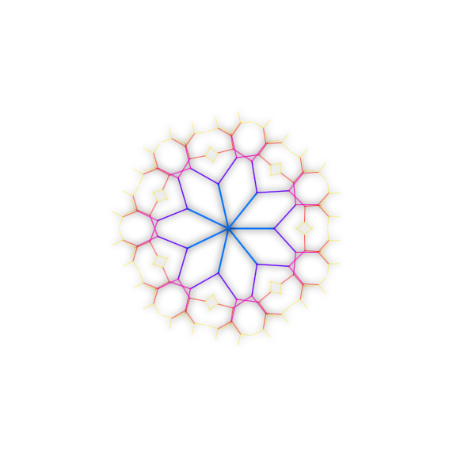

<p align="center">
    
</p>

# JS Fractals

A collection of interactive fractal generators built with JavaScript and Canvas API.

## Features

- **Mandelbrot Set**: Explore the classic fractal with zoom and pan capabilities.
- **Julia Sets**: Dynamic Julia set generation based on mouse position or custom constants.
- **Sierpinski Gasket**: Recursive triangle subdivision.
- **Koch Snowflake**: Implementation of the Koch curve.

### Installation

1. Clone the repository:

   ```bash
   git clone https://github.com/AdeelAhmedHashmi/fun-coding.git
   cd fun-coding/fractials
   ```

2. Open `index.html` in your browser or use a local server:
   ```bash
   npx serve .
   ```
